<table>
<tr>
<td>

</td>
</tr>
</table>

# BRIAN  

###(anagram of Brain )
Robot based on the awesome work of Theo Jansen called Rhinoceros

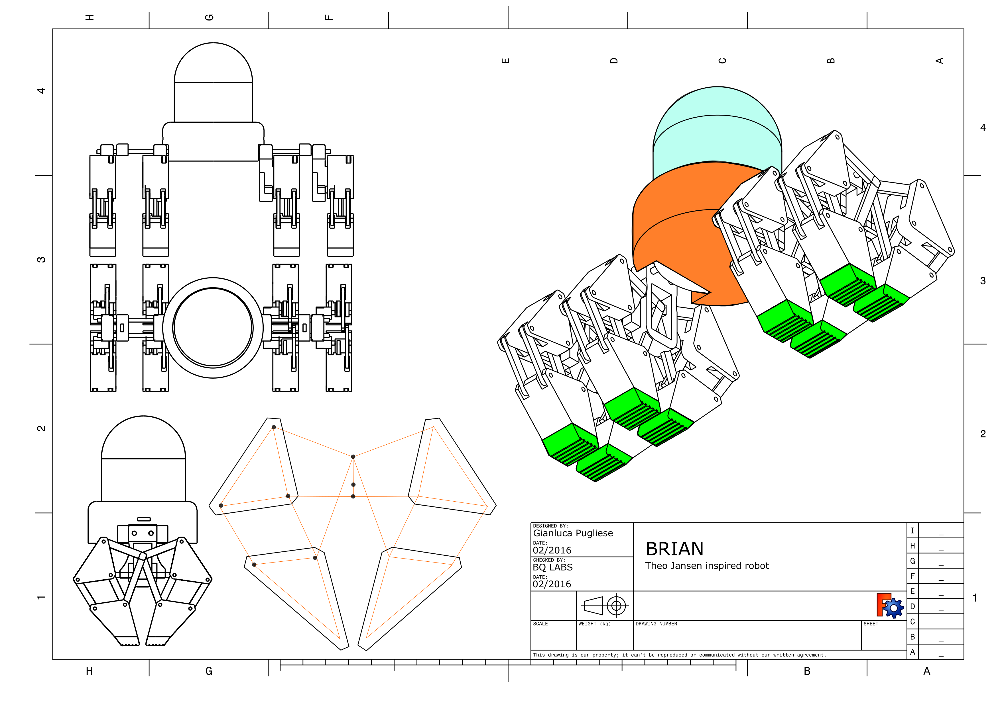

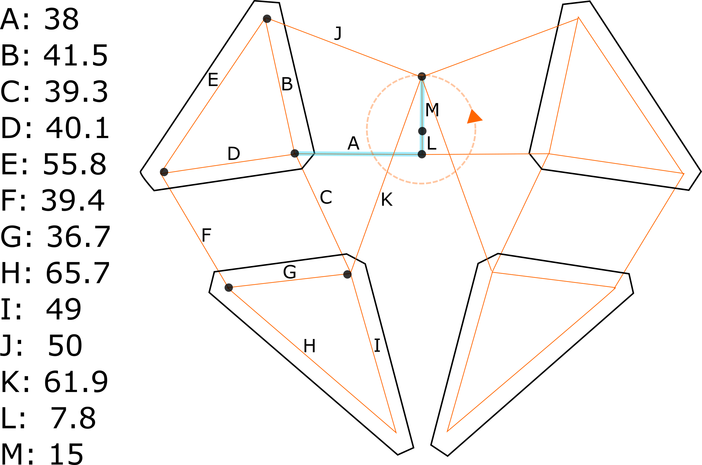

## BOM
- 4 SERVO SM-S4303R  continous rotation [example](https://www.pololu.com/product/1248)
- 1 [Zum board](http://3d.bq.com/zum.html) or compatible Arduino/Genuino board with Bluetooth feature
- 1 Battery pack 6V 2A
- 3D printed parts

## Files

###CAD

**basical measure**  is a Freecad drawing of the basic kinematic

**3D basic leg without servo**  is a Freecad drawing of the 3D kinematic

**FEET_Mold**  is a Freecad mold for silicone feet

**Doublelegs_two_servos**  is a Freecad drawing of one side legs with two servomotor

###3D Printed Parts

**BRIAN_foot**  STL of the foot, print it in flexible filament

**BRIAN_LEG**  STL of complete leg, put in in you favourite slicing SW and split the object into parts

**HEADd**  STL of the head that is the electronic enclosure

**SERVO_HOLDER**  STL of the servo holder

**2leg_plate.gcode**  Plate with two full legs made for Witbox 3D printer A4 sized build plate

**head_and4_servo.gcode**  Plate with head and 4 servo holder made for Witbox 3D printer A4 sized build plate servomotor

###FIRMWARE

**Servo_Calibration**  Sketch to calibrate continous rotation servos, it put the servo at 90 degree and with a screwdriver you cad trim the servo till it stops

**Movement_test**  Sketch for testing basic movement forward

## Assembly

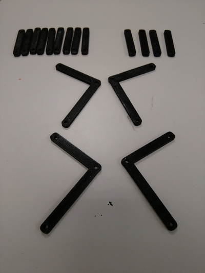
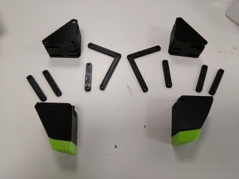
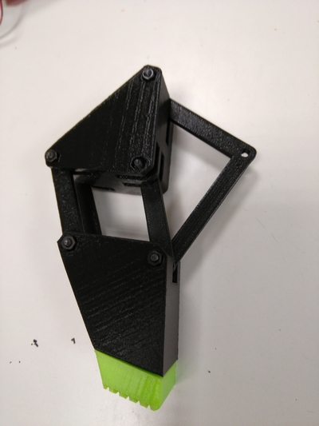
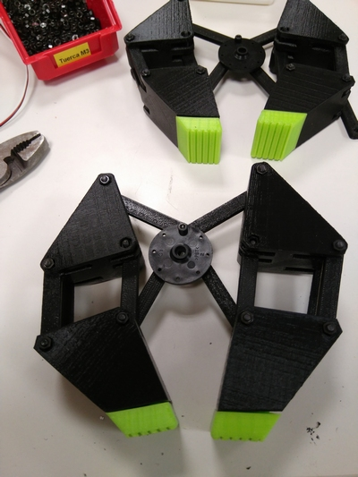

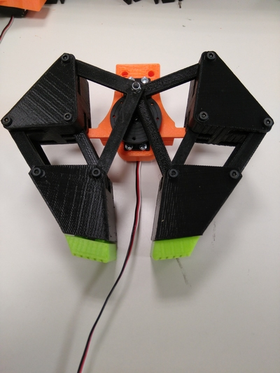
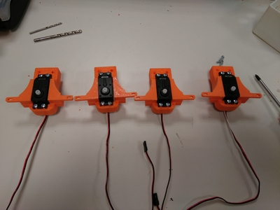
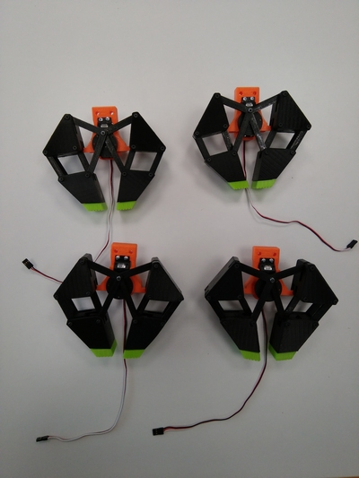
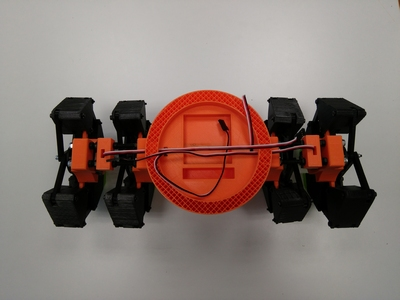

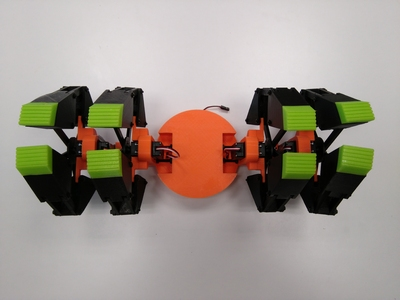
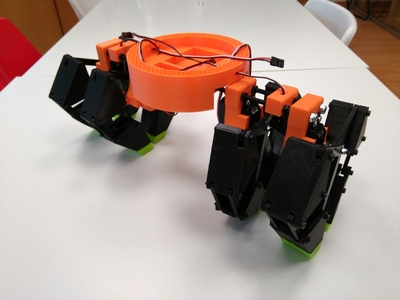

## Contributing
1. Fork it!
2. Create your feature branch: `git checkout -b my-new-feature`
3. Commit your changes: `git commit -am 'Add some feature'`
4. Push to the branch: `git push origin my-new-feature`
5. Submit a pull request :D

## Credits

Designed by Gianluca Pugliese [Owensource](https://www.owensource.com) for [BQ](https://www.bq.com)

Inspired on the awesome Rhinoceros strandbeest

- [Theo Jansen on Wikipedia](https://es.wikipedia.org/wiki/Theo_Jansen)
- [Strandbeest.com](http://www.strandbeest.com/)

## License

This robot is licensed under a [Creative Commons Attribution-ShareAlike 4.0 International License](http://creativecommons.org/licenses/by-sa/4.0/). Please read the LICENSE files for more details.

Este robot tiene una licencia [Creative Commons Attribution-ShareAlike 4.0 International License](http://creativecommons.org/licenses/by-sa/4.0/). Por favor, lea los ficheros LICENSE para más detalles
